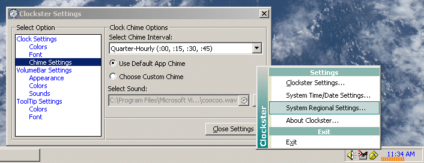



## TrayVolume Clock Toy \- Direct Access To Your Master Volume

### Description

System tray clock with a twist. I always thought it was crazy to have to double-click the tray icon to launch the mixer app just so you can adjust the volume. Since the clock is not doing a helluva lot more than wasting screen real estate, I added the ability to adjust the master volume directly from the clock window. In other words, direct access. Nothing earth-shattering here, I know, but I just wanted to solve something that nags me. Now I can double-click the volume bar at the bottom of the clock and mute the sound instantly. Clicking and dragging the mouse over the volume bar will increment/decrement the volume depending upon the direction you are going. You can also click anywhere in the area of the volume bar to set the volume level where you click. To get to the options window, double-click the clock area which is above the volume bar. The clock's fore and backcolors can be changed. Hopefully I can add more customizations and features later. To exit the clock toy, press Ctrl--> Shift --> and click on the clock at the same time. As with all my code lately, I piggy-backed from Carlos P.V.'s fader code and employ Paul Caton's WinSubHook2....I know there are a couple of minor issues and the ones I don't know about, I am sure I will hear about them. Comments and suggestions welcome! Just compile it and place a shortcut to the exe in your startup folder if you want direct access to your master volume. Enjoy and happy coding! ;-)
 
### More Info
 

             |
---                |---
**Submitted On**   |2005-01-25 14:48:16
**By**             |[AlT](https://github.com/Planet-Source-Code/PSCIndex/blob/master/ByAuthor/alt.md)
**Level**          |Intermediate
**User Rating**    |4.9 (54 globes from 11 users)
**Compatibility**  |VB 5\.0, VB 6\.0
**Category**       |[Complete Applications](https://github.com/Planet-Source-Code/PSCIndex/blob/master/ByCategory/complete-applications__1-27.md)
**World**          |[Visual Basic](https://github.com/Planet-Source-Code/PSCIndex/blob/master/ByWorld/visual-basic.md)
**Archive File**   |[TrayVolume1844161252005\.zip](https://github.com/Planet-Source-Code/alt-trayvolume-clock-toy-direct-access-to-your-master-volume__1-58133/archive/master.zip)

